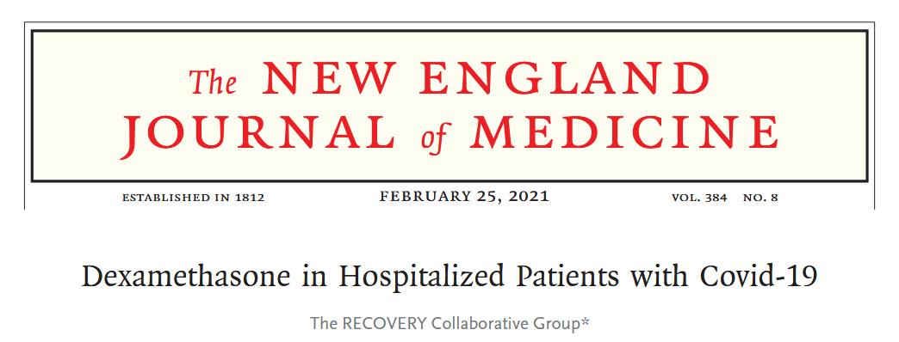
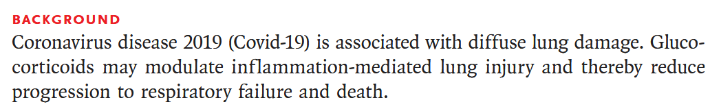

# [Dexamethasone in Hospitalized Patients with Covid-19](https://www.nejm.org/doi/pdf/10.1056/NEJMoa2021436)

To understand how to approach a paper, we will use the example of the paper "Dexamethasone in Hospitalized Patients with Covid-19" by Horby et al. (2020). This paper was published in the New England Journal of Medicine and is a landmark study in the treatment of Covid-19.  

## Starting with the abstract

A paper will be prefaced with an abstract which is a summary of the paper.  Increasingly, abstracts are 
structured into sections such as 'Background', 'Methods', 'Results', and 'Conclusions'.  This is a good place to start to get an overview of the paper.  The abstract should be read carefully, as it will give you a good idea of the key findings and the methods used in the study.

### Background

Short and simple, the background section gives the context of the study.  It explains why the study was done and what the authors hoped to achieve.  In this case, the authors are investigating the use of dexamethasone 
(a glucocorticoid) as a way of reducing respiratory failure/ death by offsetting inflammation-mediated lung injury.

### Methods

Next we consider the design, and intended analysis:

- **Design**: the study is a randomized controlled trial (RCT) with 
participants assigned to either treatment group (oral vs intravenous dexamethasone) or 
control group (usual care).
- **Primary end point**: 28-day mortality.

The methods give us a good starting point to understand the study, but raises a few questions:

- Given patients were randomized - how was randomization performed?
- An oral dosage is less definitive to administer than an intravenous dosage, was compliance ensured for the treatment group (especially the oral dosage)?
- We don't know what the sample size was, or how it was calculated.  Was it adequate to detect a 
clinically meaningful difference in the primary outcome?
- The outcome is mortality, which is a clear and objective measure, but what sort of  survival analysis will they perform?
- Have they allowed for confounding?
- Was the patient cohort balanced for confounding variables?
- Were there any losses to follow up, and how was it allowed for?
- For the patients who receive 'usual care' - what does that mean?  Is it a standard treatment, or is it variable?  

### Results

The results section lays out the core findings of the study.  We can see:

- The sample size, the study enrolled 6425 patients, with 2104 receiving dexamethasone and 4321 receiving usual care.  Though they aren't explicitly stating the balance of oral to intravenous dexamethasone.
- The primary 'unadjusted' effect size - 22.9% compared to 25.7%
- The  primary 'adjusted' effect size - 0.83 (95% CI 0.75-0.93) with p-value < 0.0001.
- That a secondary analysis was performed on the subgroup of patients who were receiving mechanical ventilation at the time of randomization.

The core findings are reasonably clear; there is evidence dexamethasone reduces mortality in hospitalized patients with Covid-19, and is more effective in those receiving mechanical ventilation.  This fits with 
the earlier suggestion that dexamethasone acts by 'offsetting inflammation-mediated lung injury' which would
be indicative of ventilation and oxygen.

### Conclussions

Which brings us to the conclusions.  Reflecting the relevance of the secondary analysis, the authors conclude that dexamethasone is effective in reducing mortality for patients receiving mechanical ventilation or oxygen when hospitalized with Covid-19.

From the abstract, we now have a good understanding of the study design, the primary outcome, and the key findings.  We also have a list of questions that we can use to guide our reading of the full paper.

## Answering our questions

### Q1 - How was randomisation performed?

Poor randomisation can lead to bias in the study results.  The authors state that randomisation was performed using a computer-generated random number sequence, which is a good method.  However, they do not provide any details on how the randomisation was implemented, or whether it was done in a way that ensured balance between the treatment and control groups.  

The section also describes inclusion and exclusion criteria.  Medical judgement was used to determine 
if patients had definitive indication, or contraindication of dexamethasone; so the study would be limited 
to the existing safety guidelines for usage of dexamethasone.  Plus, dexamethasone  was not available at all sites, and hence a geo-political bias may have been created - it's feasible the reason some hospitals would not 
have dexamethasone is related to the socio-economic conditions of the demographics it serve so the study might under-represent certain populations.   

The section also indicates that patients were enrolled to multiple treatment protocols under the wider RECOVERY trial, though it doesn't detail how a particular regiments was assigned.  Depending on the number and breadth of treatments proposed this could create a source of bias; patients are randomized to the treatment arm but certain treatments may be prioritized in different scenarios.

### Q2 - An oral dosage is less definitive to administer than an intravenous dosage, was compliance ensured for the treatment group (especially the oral dosage)?

The paper does not provide any details on how compliance was ensured for the treatment group.  Without reporting compliance there is a potential limitation of the study, as it is possible that patients in the treatment group did not receive the full dose of dexamethasone, which could have affected the results. It also doesn't go into detail as to what proportion of patients received oral vs intravenous dexamethasone, or establish that the method of delivery was consistent across the treatment group.  

### Q3 -  We don't know what the sample size was, or how it was calculated.  Was it adequate to detect a 
clinically meaningful difference in the primary outcome?

The sample size was not defined in the protocol, but instead was determined as the trial was ongoing.  
Similar 'adaptive sample size' calculations are becoming more common place as the sample size 
calculation is highly dependent on the viable effect, which if known would have rendered the study unnecesary.  
In this case, it was left to the steering committee to determine the 'clinically rele-
vant proportional reduction' that would be deemed valuable for the change in practice.  The study states the  desired p-value and power for the study, though not the specific methodology used to arrise at the sample size or if it allowed for adjustment factors.

### Q4 - The outcome is mortality, which is a clear and objective measure, but what sort of  survival analysis will they perform?

The authors state that they will use a Cox proportional hazards model to analyze the data.  This is a common method for analyzing survival data, and is appropriate for this study.  The study goes on to explore secondary analyses via binomial logistic regression, which is also appropriate for the data.  

### Q5 - Have they allowed for confounding?

### Q6 - Was the patient cohort balanced for confounding variables?

### Q7 - Were there any losses to follow up, and how was it allowed for?
- For the patients who receive 'usual care' - what does that mean?  Is it a standard treatment, or is it variable?  

