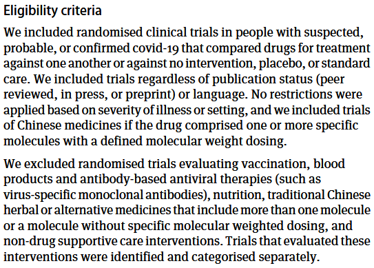

```{r, include = FALSE}
knitr::opts_chunk$set(
  collapse = TRUE,
  comment = "#>"
)
# Describe what a meta analysis is for, how they are performed and any guidelines.
```

# Meta-analysis 

A meta-analysis is a statistical technique that combines the results of multiple studies to provide a more precise estimate of the effect of an intervention or exposure. It is often used in systematic reviews to synthesize evidence from different studies, allowing researchers to draw more robust conclusions than would be possible from individual studies alone.

## Steps involved in a meta-analysis

To perform a meta-analysis, researchers typically follow a systematic approach, following guidelines such as PRISMA (Preferred Reporting Items for Systematic Reviews and Meta-Analyses), that includes the following steps:

1. **Define the research question**: A clear statement of the research question or hypothesis that the meta-analysis aims to address.
2. **Systematic literature search**: Comprehensive searches of relevant databases (e.g. PubMed, Cochrane Library) to identify studies that meet predefined inclusion and exclusion criteria.
3. **Data Extraction**: Description of the process of extracting relevant data from the selected studies, including study characteristics, sample sizes, effect sizes, and confidence intervals.
Each study should be assessed for quality and risk of bias, using appropriate tools such as the Cochrane Risk of Bias tool or the Newcastle-Ottawa Scale.
4. **Statistical modelling**:  The use of statistical software (e.g., R, Stata) to calculate pooled effect sizes and confidence intervals to summarize the effect sizes across studies. The choice of model depends on the degree of heterogeneity among the studies (assessed  using I² statistics) and may involve sensitivity analyses if necessary.  
5. **Interpretation of results**: A summary of the findings, including the overall effect size, confidence intervals, and any potential sources of bias or heterogeneity.

## Example Meta-analysis

### [Drug treatments for covid-19: living systematic review and network
meta-analysis](https://www.bmj.com/content/370/bmj.m2980.abstract)

1. **Define the research question**: **What is the best treatment for Covid-19**

2. **Systematic literature search**: 
- Data sources: The WHO Covid-19 database (comprising Medline, PubMed, and Cochrane Library among others), and the Wanfang, Chinese Biomedical Literature, China National Knowledge Infrastructure, VIP, Chinese Medical Journal Net (preprints), and ChinaXiv(preprints) databases.

- Inclusion criteria: 




3. **Data Extraction**: 


4. **Statistical modelling**:  

Technique: **Pair-wise and Network meta-analysis using a Bayesian framework**
- 'Pair-wise' analysis considers the evidence if treatment A or B is superior.
- 'Network' analysis considers the evidence if treatment A is superior to B, C, D, etc. and if B is superior to C, D, etc. This allows for indirect comparisons between treatments that have not been directly compared in trials.  The resultant network is presented [here](https://www.bmj.com/content/370/bmj.m2980.abstract).
- 'Bayesian' refers to the statistical approach used to estimate the probability of each treatment being the best, based on the available evidence. This approach allows for the incorporation of prior knowledge and uncertainty in the analysis.  

5. **Interpretation of results**:


## Further Reading

[How to conduct a meta‑analysis in eight steps: a practical
guide](https://link.springer.com/content/pdf/10.1007/s11301-021-00247-4.pdf)

[RevMan software](https://revman.cochrane.org/info)


