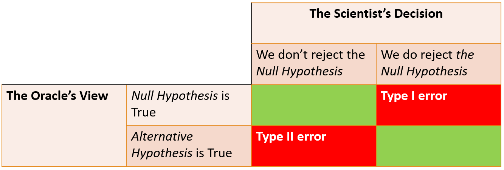
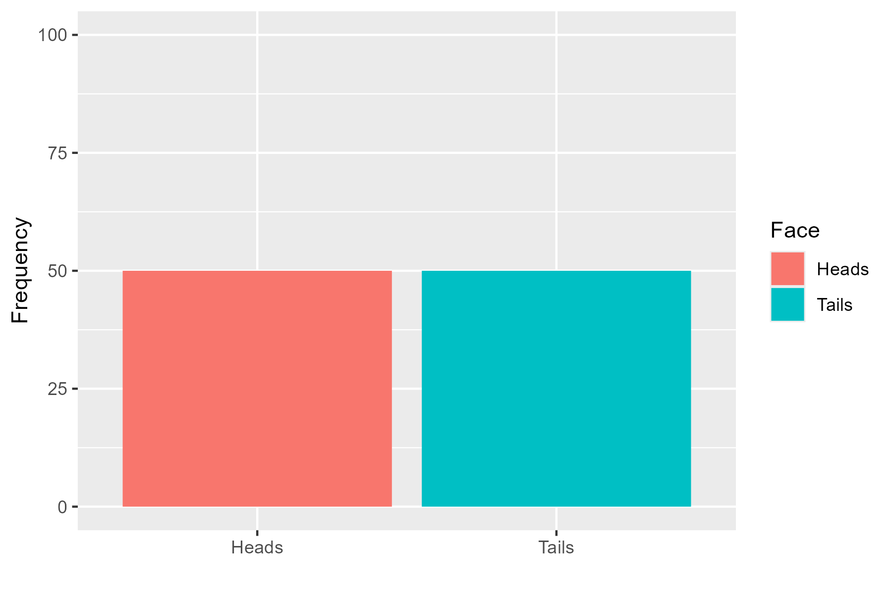
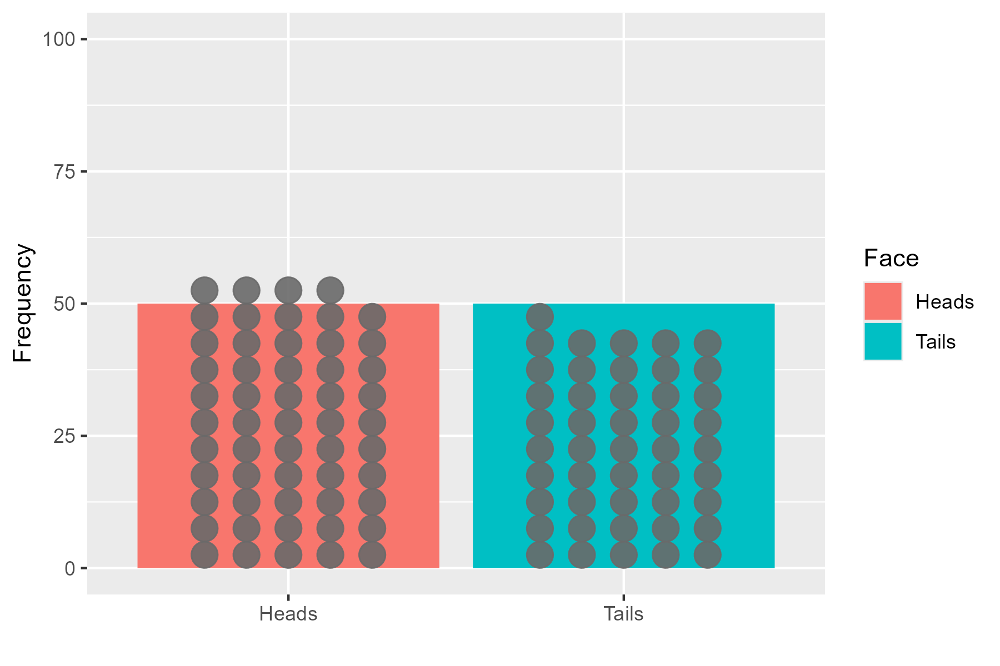
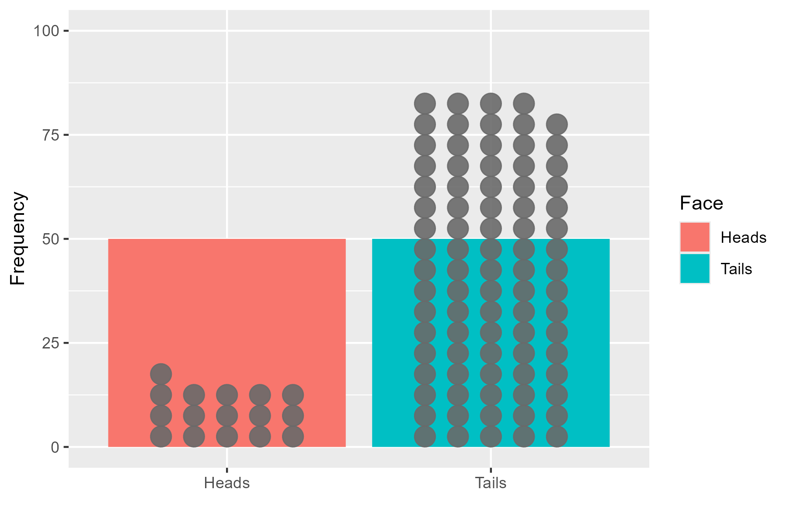
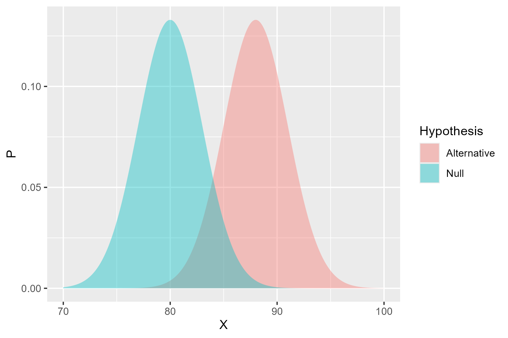
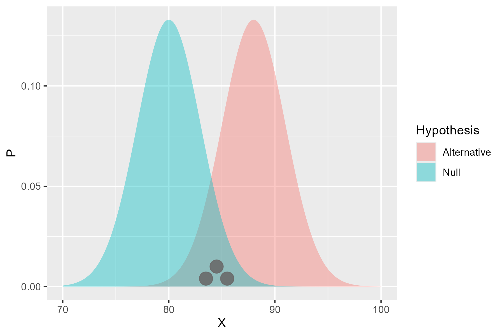
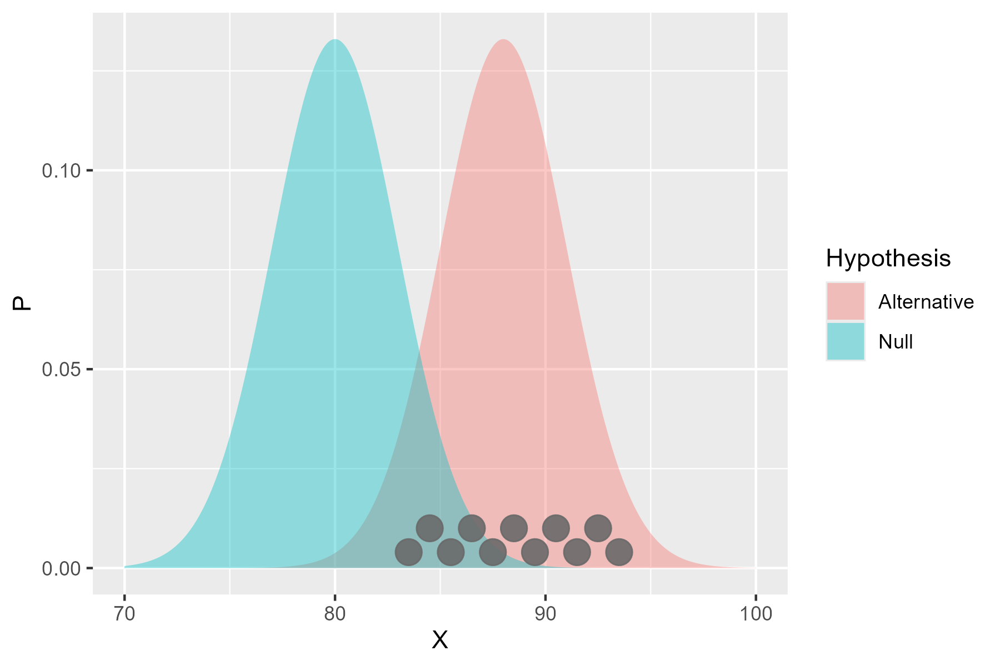

```{r, include = FALSE}
knitr::opts_chunk$set(
  collapse = TRUE,
  comment = "#>"
)
```

## Introduction

In the first module, we discussed the concept of a hypothesis and outlined the basic 
idea of aiming to disprove a hypothesis.  The framework came about due to the combination 
of two existing frameworks for examining the results of experiments: 

* the *Fisher* framework, which focused on the idea of a *null hypothesis* and the probability of observing the data if the null hypothesis were true; and
* the *Neyman-Pearson* framework, which focused on the idea of a *testable hypothesis* and the probability of observing the data if the testable hypothesis were true.

Now - these two frameworks were developed at roughly the same time as each other, 
with the two academic camps being deeply sceptical of each other's work.
Fisher, as an experimental scientist, developed the null hypothesis framework
from the perspective of 'once data has been collected, how do we test it'.  His methods 
were designed to be used after the data had been collected, and were focused on 
estimating the probability of the data, if we assumed the null hypothesis were true.

Neyman and Pearson, as theoretical mathematicians, developed their testable hypothesis 
framework from the perspective of 'how do we design an experiment to test a hypothesis'.  
Their methods were designed to be used before the data had been collected, and 
were focused on estimating the probability of the data, under both the null and testable hypotheses.

Fisher introduced the concept that if a p-value (the 'probability of the data if 
our assumptions were true') was smaller than 0.05 (5%), we can conclude their is little 'evidence'
in our data that the assumptions were true.   Neyman and Pearson (N&P) expanded on this idea, 
questioning what we could conclude not about our assumptions, but the  alternative to them, 
formalizing the concept of the *alternative hypothesis* (the 'something else' that is occurring).

N&P theorized that any experiment would be divided into two possible outcomes - 
either the null hypothesis is true, or the alternative hypothesis is true. 
Hence, the observations that have been made would either support the null hypothesis or the alternative hypothesis.
The likelihood of the observations under each hypothesis could be calculated, and the hypothesis with the higher likelihood would be considered the more likely to be true.  
The statistician could set a threshold, e.g. 10 times more likely, at which the null hypothesis would be rejected in favour of the alternative hypothesis. In practice, this meant that the experimenter could derive a *critical value* 
for the test statistic and if the observed test statistic was greater than the critical value,
the null hypothesis would be rejected in favour of the alternative hypothesis.

Now - Fisher did not like this idea, and argued that i) the null hypothesis should not be 
rejected, but rather that we should conclude that there is insufficient evidence to support it and
ii) that the alternative hypothesis was unnecessary.
Neyman and Pearson, however, argued that the alternative hypothesis was necessary to provide a
framework for hypothesis testing, and that the null hypothesis should be rejected in favour of the alternative hypothesis if the evidence supported it.

While we can see this as splitting hairs, it was viewed as a fundamental difference in approach to hypothesis testing.  This makes our current state confusing as *Null Hypothesis Significance Testing* (NHST) 
is a combination of the two frameworks, aiming to take the best of each while avoiding the worst of each.

## Null Hypothesis Significance Testing (NHST)

The framework begins with some hypothesis about the world, e.g. if we wanted to check if a coin was 'fair':

> Null hypothesis: The coin is fair (i.e. $P(Heads)  = 0.5$)

and the alternative hypothesis:

> Alternative hypothesis: The coin is not fair (i.e. $P(Heads)  != 0.5$)

To collect data we can repeatedly toss the coin and count how often we see heads.  
We need to know i) how many heads are too many/ too few and ii) how many tosses 
do I need to make to be certain?  

The key thought of NHST comes from observing the universe in two ways: 

1. as an all knowing Oracle
2. as an experimental scientist

When these two viewpoints observe the same experiment the Oracle knows with 
complete certainty if the null or alternative hypothesis is true, while the scientist 
 doesn't.  We hence have four possible outcomes:
 


The 'Type I Error' is when the experimental data suggests the null hypothesis is incorrect
when it was actually true (also known as a *false positive*), and is essentially what we mean
by significant.  When we say that a result is 'significant' at a 0.05 level, we 
are concluding their is an effect and  we are willing to accept a 5% chance of making a Type I error, i.e.
we are willing to accept a 5% chance of rejecting the null hypothesis when it is actually true.

The 'Type II Error' is when the experimental data suggests the null hypothesis is correct, 
when it was actually false (i.e. a *false negative*) and is related to the concept of a 
studies **Power** (how likely we are to find a given relationship if it exists).  
If a study is powered at the 80% level, it means they believe the study is able to detect 
(e.g. report a p-value below 0.05) the assumed alternative hypothesis 8 times out of 10.
The other 20% of the time the study wouldn't find the assumed behaviour, and hence 
at the design stage  they were happy to accept a 20% chance of making a Type II Error.


### But what makes a p-value?

A host of inferential tests exist for analysing data (t-test, $\chi^2$ test, ANOVA analysis etc) 
but they all operate in a similar manner to produce a p-value.   They begin by 
deriving a model for the data *assuming the null hypothesis is true*.  Each test assumes a 
different set of hypothesis (e.g. the Z-test assumes the data is normally distributed with a given 
mean) and determines 'how likely is it the observed data comes from this model'.  

Let's think about this pictorially.  We thought of the fair coin earlier where our 
null hypothesis would be $P(Heads) = 0.5$.  If we were to toss a coin 100 times, 
we would expect to see:



When the data has been collected we would see one of two outcomes - either the tosses follow 
the hypothetical model:



or it deviates from it:



The data doesn't have to perfectly follow the model, but large deviations mean the data
is unlikely to have come from the model, and so the p-value is reduced.  

In modern data analysis, a user wouldn't be required to calculate a p-value by hand 
and instead make use of a statistical package (e.g. R, Python, SPSS) to calculate the p-value for them.
What matters more is understanding what the result means and the assumptions that underpin 
the particular test statistic.  Remember, a low p-value means that the assumed distribution
isn't a good fit for the data, but this could be any of the assumptions, not just your specific 
null hypothesis.

### What effects the power?

It may have come as a surprise that many studies are only powered at an 80% level;
going through all the struggle of data collection and analysis, only to find that
only 4 out of 5 times will the study find the effect it is looking for.

You might wonder why don't we power at 100%?  Let's take a look at the idea of power in 
pictures and see if we can understand why this is the case.  The basic idea is to draw up our two
hypotheses, e.g. if we were testing if a new fetrilizer causes a better yield of crops, we might have:

> Null hypothesis: The fertilizer has no effect on crop yield 

and

> Alternative hypothesis: The fertilizer has a positive effect on crop yield

Now, crop yield is not deterministic - there are some uncontrolled factors that will affect the yield,
alongside natural noise.  Having spoken with agricultural scientists, we might assume that the
crops without the new fertilizer have a mean yield between 75kg and 85kg.
Similarly, the crops with the fertilizer are expected to yield about 8kg more.
Pictorially - these assumption would look like this:



So the power calculation asks 'how many observations would I need from the alternative hypothesis
before I can be certain I'll reject the null hypothesis'.  If we only take a few observations:



There's a chance they won't be different from the null hypothesis.  But, as we take 
more and more:



The distribution is more likely to be equally spread around the alternative
hypothesis, and so the chance of rejecting the null hypothesis increases.  The power is hence
dependent on:

1. the number of observations 
2. the size of the effect 
3. the noise in the data.

Let's assume that we can't change our experimental apparatus, so the size of the effect and 
noise are constant.  Now - the more observations we have to make the more resource intensive the 
research is, and the less ethical it may be (if we are exposing more participants to risk).  
But - if we don't observe enough participants for the study to be properly powered,
then the participants have been put at risk for no benefit (deeply unethical).  
So the only control we have is the sample size, and there can be ethical flaws to having too many or 
too few observations.

### Steps beyond NHST


